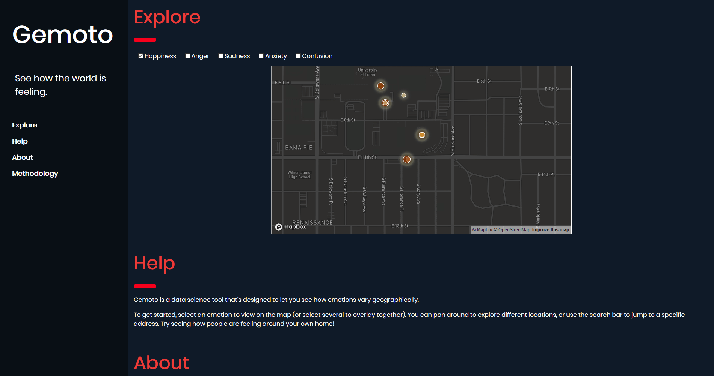
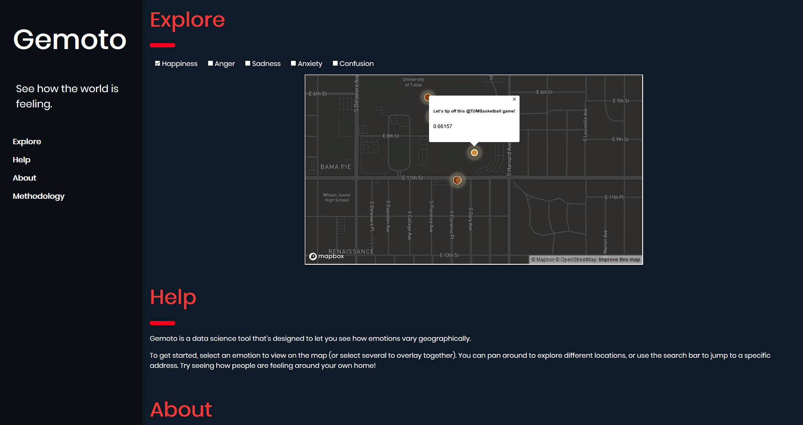

# Test Cases

## Automated Testing

Use cases 1 and 2 are tested via the automated testing script  `test.py`. Test cases 3 and 4 are required to be tested by a human and the testing methodology is outlined below

## Human Testing

### Test Case 3

Use Case 3 is designed to show that the website is functioning in the most basic, barebones way for a user to load and see in their browser. It is tested as follows:

1. Navigate in a web browser to the following address: <a href="http://129.244.254.112/" target="_blank">Gemoto</a>
    * Ensure that your adblocker is turned off, as adblockers do not allow `MapBox` to load properly
2. Ensure that you are presented with a map that has some color in areas around the University of Tulsa. It should look like this: 
3. If an image similar to the one appear (with colors show in the map) the test passes!

### Test Case 4

Use Case 4 is designed to test the functionality of MapBox so that a user can interaction with the map visualization and retrieve more detailed data from the visualization. Test case 4 has the following criteria requirements:
1. Zoom-in ability
2. Zoom-out ability
3. Display detailed information
4. Map movement ability 

The test should be performed as follows:

1. Navigate in a web browser to the following address: <a href="http://129.244.254.112/" target="_blank">Gemoto</a>
    * Ensure that your adblocker is turned off, as adblockers do not allow `MapBox` to load properly
2. Ensure that you are presented with a map that has some color in areas around the University of Tulsa. It should look like this: 
3. Place your cursor in the map area and scroll in
4. Ensure the map zooms in the location of the cursor
    * If the map zooms in, test criteria 1 passes successfully
5. Again place your cursor somewhere in the map area and scroll out
6. Ensure the map zooms out from the cursor location
    * If the map zooms out, test criteria 2 passes successfully
7. Place the cursor on a colored dot and click
8. Ensure that a small popup appears above the cursor with the following criteria:
    * Text that appears to be a tweet from that location
    * A decimal number, representing the amount of `Joy` the system generated for that tweet
    * It should look as follows:
    
    * If the information appears as above, test criteria 3 passes successfully
9. Place the cursor on the map, not on the popup information box. Click and drag the cursor around
10. Ensure the map moves with cursor movement as the mouse is pressed down
    * If the map moves, test criteria 4 passes successfully
11. If all 4 test criteria pass, then the test is successful!
    